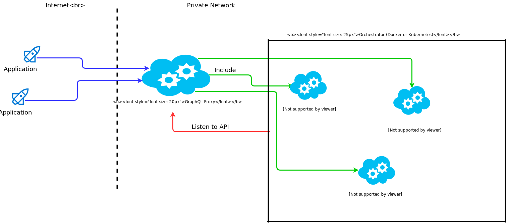

# GraphqlDockerProxy
A generic Graphql Docker Proxy 

It's a GraphQL API Gateway. 

[](https://hub.docker.com/r/fasibio/graphqldockerproxy/) 




# Features
 - Continuously integrate the Backend GraphQLs (**No restart!**)
 - !!!It works with **Docker** and **Kubernetes**!!!
 - Support auto of the box load balance (at docker)


# Run with Docker (Quickstart)
## How Does it Work: 
It works without dependencies. 
You can start it in your docker cloud. 
Use it to manage your GraphQL-Microservices. With docker labels you can registory your microservices in the proxy.
The proxy automatically will find your services and add them to the gateway.

## How to Start the Proxy
In this example we will use docker-compose to start the proxy. 
Here is an example docker-compose file: 
```
version: '3'
services: 
  api: 
    restart: always
    image: fasibio/graphqldockerproxy
    expose:
      - 3000
    ports:
      - 3000:3000
    networks:
     - web
    environment: 
      - qglProxyRuntime=docker
      - dockerNetwork=web
      - gqlProxyToken=1234
    volumes: 
     - /var/run/docker.sock:/var/run/docker.sock
networks:
  web:
    external: true
```
This will start the proxy on port 3000. 
It's important to include the ```docker.sock``` as volume.
You can do this with the following environment variables:
- ```qglProxyRuntime```: can be ```docker``` or ```kubernetes```. For Docker you need docker ^^
 - ```dockerNetwork```: the network where the backend GraphQL-Server will run
 - ```gqlProxyToken```: a token which verifies that the microservice belongs to the proxy 

 That's all!!
 Now you can open the proxy under http://127.0.0.1:3000/graphiql .
 The API is reachable under http://127.0.0.1:3000/graphql .

 At the moment it is an empty gateway. 

 ## Let's Start a GraphQL Microservice 

 It is imporant to put your microservice in the same network as the proxy (In this example the network is called 'web'). 
 Now you have to set the following labels: 
  - ```gqlProxy.token```: The same token you set in the proxy. (In this example 1234)
  - ```gqlProxy.url```: This is the relative path to the proxy running inside the container. (For example: :9000/graphql)
  - ```gqlProxy.namespace```: The namespace that wraps your microservice.

  ## Let's Write an Example Microservice
  For this example we will use the Docker image ```bfillmer/graphql-swapi```

  Create a docker-compose file: 
  ```
  version: '3'
  services: 
    swapi: 
      image: bfillmer/graphql-swapi
      expose:
        - 9000
      networks: 
        - web
      labels: 
        - gqlProxy.token=1234
        - gqlProxy.url=:9000/graphql
        - gqlProxy.namespace=swapi
networks:
    web:
      external: true
  ```

Start the docker-compose file. 
The proxy will automatically find the microservice and include it.
Under http://127.0.0.1:3000/graphiql you can now see that swapi is now wrapping your graphql microservice 
Inside this namespace you can make graphql requests. 
For example:
```
{
  swapi{
    allFilms{
      films{
        title
      }
    }
  }
}
```

Or use the adminpage to see what is included http://127.0.0.1:3000/admin/graphiq

## Now Let's Scale the GraphQL Microservice !
The proxy knows how to reference the same images with a round robin loadbalancer. 

Go in the folder where the SWAPI service is. 

Enter the command: 
```sudo docker-compose scale swapi=3```

The proxy will automatically start a loadbalancer


### Note
You can find examples (and docker-compose files) in the example directory of this git project.


# Run with Kubernetes

Complete Doku will coming soon. 

The service is available for Kubernetes. 
It will use the Kubernetes API to find available GraphQL Endpoints. 

General use is the same like docker. 
See "How it works with Docker".
You have to set labels in the Deployment-Manifest.

The following labels a available/necessary 
- ```qglProxyRuntime```: can be ```docker``` or ```kubernetes```. For Kubernetes you need kubernetes ^^
- ```gqlProxyToken```: a token which verifies that the microservice belongs to the proxy 
- ```kubernetesConfigurationKind```: How the proxy find the Kubernetes API. 
  - ```fromKubeconfig```: A Config file which is mount in the Container
  - ```getInCluster```: The POD as it self.

Here is a Example How to run:  

## The Yaml for the GraphQL Proxy:

Deployment.yaml
```
apiVersion: extensions/v1beta1
kind: Deployment
metadata:
  annotations:
    kompose.cmd: kompose convert
    kompose.version: 1.13.0 (84fa826)
  creationTimestamp: null
  labels:
    io.kompose.service: api
  name: api
  namespace: gqlproxy
spec:
  replicas: 1
  strategy: {}
  template:
    metadata:
      creationTimestamp: null
      labels:
        io.kompose.service: api
    spec:
      containers:
      - env:
        - name: gqlProxyToken
          value: "1234"
        - name: kubernetesConfigurationKind
          value: getInCluster
        - name: qglProxyRuntime
          value: kubernetes
        image: fasibio/graphqldockerproxy
        name: api
        ports:
        - containerPort: 3000
        resources: {}
      restartPolicy: Always
status: {}

```

serice.yaml
```
apiVersion: v1
kind: Service
metadata:
  annotations:
    kompose.cmd: kompose convert
    kompose.version: 1.13.0 (84fa826)
  creationTimestamp: null
  labels:
    io.kompose.service: api
  name: api
  namespace: gqlproxy
spec:
  ports:
  - name: "3000"
    port: 3000
    targetPort: 3000
  selector:
    io.kompose.service: api
status:
  loadBalancer: {}

```

## The Yaml for the GraphQL (SWAPI)

Here it is importend that the ```service``` have the ```annotations``` 
  - ```gqlProxy.token```: The same token you set in the proxy. (In this example 1234)
  - ```gqlProxy.url```: This is the relative path to the proxy running inside the container. (For example: :9000/graphql)
  - ```gqlProxy.namespace```: The namespace that wraps your microservice.


```
---
kind: Deployment
apiVersion: extensions/v1beta1
metadata:
  
  labels:
    app:     swapi
  name:      swapi
  namespace: starwars
spec:
  minReadySeconds: 20
  replicas: 2
  revisionHistoryLimit: 32
  template:
    metadata:
      name: swapi
      labels:
        app: swapi
    spec:
      terminationGracePeriodSeconds: 1
      containers:
        - image: bfillmer/graphql-swapi
          imagePullPolicy: Always
          name: swapi
          ports:
            - containerPort: 9000
              name: http-port
---
kind: Service
apiVersion: v1
metadata:
  annotations:
    gqlProxy.token: '1234'
    gqlProxy.url: ':9001/graphql'
    gqlProxy.namespace: 'swapi'
  labels:
    name: swapi
  name:      swapi
  namespace: starwars
spec:
  ports:
    - port: 9001
      targetPort: 9000
      name: http
  selector:
    app: swapi

```
## All About Namespaces<a name="allAboutNamespaces"></a>
Namespaces are set by the GraphQl backend microservice, with the label ```gqlProxy.namespace```.
If you need more than one GraphQL backend server in the same namespace, then give the same name in the label ```gqlProxy.namespace```. The proxy will merge the services. 


### WARNING!!!!
At the moment it's not possible to have same queries, mutations or types for different entities. The proxy will use the first one it finds. 


# Admin page / Metadata Page
To See what the proxy have include und find an other graphqlServer under ```/admin/graphql``` there is a graphiql to (```/admin/graphiql```)
There you see all Namespace and the endpoints, which was included. 
If a endpoints is loadbalance, you can find all all nested "real" endpoints. 
With the environment ```gqlProxyAdminUser``` and ```gqlProxyAdminPassword``` you can set a Basic Auth for the admin page.

## Available Environments for the GraphQL Proxy

Key | Available Values | Default | Description | Need for | Required 
--- | --- | --- | --- | --- | ---
| ```qglProxyRuntime``` | ```docker``` or ```kubernetes``` | ```docker``` | tells the proxy run in a docker or in a kubernetes world | docker and kubernetes | true 
|```dockerNetwork``` | string | none | the network where the backend GraphQL-Server shard with the proxy| docker | for docker
| ```gqlProxyToken``` | string | empty string | a token which verifies that the microservice belongs to the proxy | both | false but better you set it
|```kubernetesConfigurationKind``` | ```fromKubeconfig``` or ```getInCluster``` or ```getInClusterByUser``` | ```fromKubeconfig``` | How the proxy find the Kubernetes API Config. | kubernetes | false
|```gqlProxyPollingMs```| int | 5000 | The Polling time to check for changes |  both | false
|```gqlProxyK8sUser```| string | no Default | It is only needed for ```getInClusterByUser```. The K8s user |  kubernetes | false
|```gqlProxyK8sUserPassword```| string | no Default | It is only needed for ```getInClusterByUser```. The Password for the K8s user |  kubernetes | false
|```gqlProxyAdminUser```| string | empty string | The user for Basic Auth at the admin page |  both | false
|```gqlProxyAdminPassword```| string | empty string | The password for Basic Auth user at the admin page |  both | false

### Possible Combination for Docker
  - ```qglProxyRuntime```=docker
  - ```dockerNetwork```=web
### Possible combination for Kubernetes

#### and find the user in the pod itself
  - ```qglProxyRuntime```=kubernetes
  - ```kubernetesConfigurationKind```=getInCluster

   
#### or give an explizit user
  - ```qglProxyRuntime```=kubernetes
  - ```kubernetesConfigurationKind```=getInClusterByUser
  - ```gqlProxyK8sUser```=myK8sUser
  - ```gqlProxyK8sUserPassword```=thePassword

### environments you can set in all Kombination
  - ```gqlProxyPollingMs```=10000
  - ```gqlProxyAdminUser```=myAdminPageUser
  - ```gqlProxyAdminPassword```=adminPassword


 ## Available Labels/annotations for all Backend GraphQL Server

Key | Available Values |  Description | Required 
--- | --- | --- | --- 
| ```gqlProxy.token``` |string | The same token you set in the proxy. (In this example 1234) | true 
|```gqlProxy.url``` | string |  This is the relative path to the proxy running inside the container. (For example: :9000/graphql)| true
| ```gqlProxy.namespace``` | string  | The namespace that wraps your microservice  see ["All About Namespaces"](#allAboutNamespaces) for more Information| true
